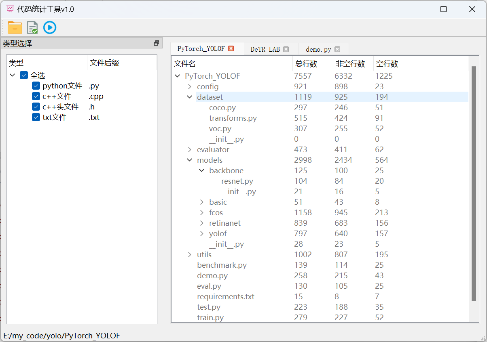

本工具提供简单的代码统计功能，支持以树形结构可视化每个文件和文件夹所包含代码的数量。


# 打包

运行`cmd.py`文件即可打包，在`dist`文件夹下已经有打包好的。


# 功能介绍



## 工具栏

- 打开文件夹：只统计左边类型选择界面选中的文件类型
- 打开文件：可以统计任意类型的文件，解析失败会报错
- 重新统计：当左边的类型选择有变化时，点击此按钮可以刷新当前页面


# 配置文件

```json
{
  "types": [
    {
      "name": "python文件",
      "suffix": ".py"
    },
    {
      "name": "c++文件",
      "suffix": ".cpp"
    },
    {
      "name": "c++头文件",
      "suffix": ".h"
    },
    {
      "name": "txt文件",
      "suffix": ".txt"
    }
  ],
  "filter": {
    "dir": [
      "^\\..*"
    ],
    "file": [
      "^\\..*"
    ]
  }
}
```

- `types`表示配置的文件类型，打开工具时会加载显示到左侧，用户可根据需要自行添加
- `filter`表示过滤器，采用正则表达式，匹配到的文件夹和文件会被过滤掉